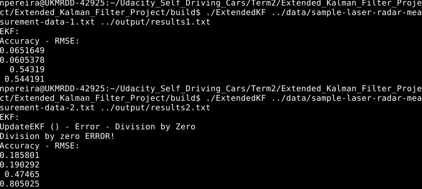

# Extended_Kalman_Filter_Project

There are 4 applications in this repository:
- Jacobian
- KalmanFilter
- KalmanFilter2D
- Extended_Kalman_Filter_Project

The Extended_Kalman_Filter_Project implements a full EKF using both Laser and Radar data.

# Results screenshot:

npereira@UKMRDD-42925:~/Udacity_Self_Driving_Cars/Term2/Extended_Kalman_Filter_Project/Extended_Kalman_Filter_Project/build$ ./ExtendedKF ../data/sample-laser-radar-measurement-data-1.txt ../output/results1.txt
EKF: 
Accuracy - RMSE:
0.0651649
0.0605378
  0.54319
 0.544191
npereira@UKMRDD-42925:~/Udacity_Self_Driving_Cars/Term2/Extended_Kalman_Filter_Project/Extended_Kalman_Filter_Project/build$ ./ExtendedKF ../data/sample-laser-radar-measurement-data-2.txt ../output/results2.txt
EKF: 
UpdateEKF () - Error - Division by Zero
Division by zero ERROR!
Accuracy - RMSE:
0.185801
0.190292
 0.47465
0.805025

# Dependencies:
cmake >= 3.5

# Compiling instructions:
Make a build directory: mkdir build && cd build
Compile: cmake .. && make
On windows, you may need to run: cmake .. -G "Unix Makefiles" && make
Run it: ./ExtendedKF path/to/input.txt path/to/output.txt. You can find some sample inputs in 'data/'.
eg. ./ExtendedKF ../data/sample-laser-radar-measurement-data-1.txt output.txt 
